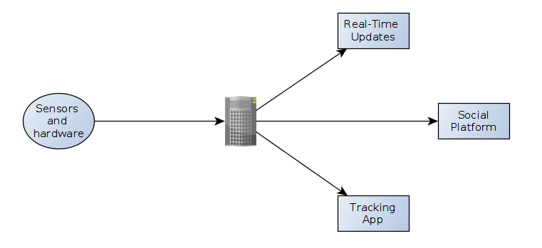
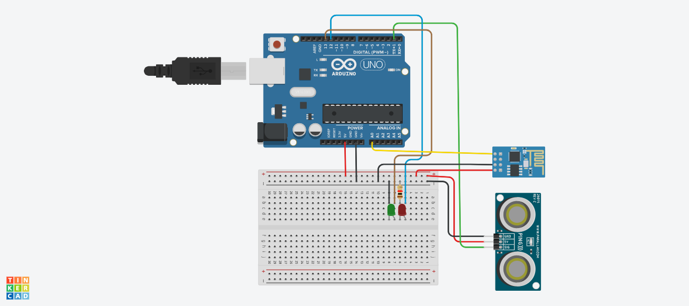

# Jeevanam

IoT Based Water Usage Tracking App For Project (J) -Component Of CSE3009: Internet Of Things

## Why Jeevanam | Objectives

- Making an IoT based water conversation model which can detect water wastage

- Real time updates in case of water wastage and alerts for excessive water wastage.

- Spreading awareness about water shortage and importance of saving water

- Developing an online dashboard which gives updates in case water is being wasted.

- Developing a community/social media around the platform which can be used to make people aware of how much water each person is wasting and giving rewards/incentives to people who waste least amount of water.

## Abstract

Almost 800 million people lack access to clean safe water every day. That's more than two and a half times the population of the United States, where most of us probably waste more water before noon than those people use in a month. 
To counter this problem, this project can be of great help. I intend to make an IoT based smart water conservation system. There are some automatic taps which are capable of saving water, but their costs are high and an average family can not afford them, so automation of taps is a problem. So, my idea is to make a device which can be attached to the taps and it will be able to send alerts in case of water wastage, and moreover, an application connected to it where one can keep a track of how much water he/she has wasted. 
Along with it, there will be a community/social media around the platform which can be used to make people aw are of how much water each person is wasting and giving rewards/incentives to people who waste least amount of water. Therefore, people who waste least amount of water can get incentives as well as respect in the society and others get inspiration from them.

### Principles and Motivation

The device is powered by 3 pillars, 

1. **Trust** - The social platform will increase trust and reliability

2. **Innovation** -Innovation powers efficiency

3. **Performance** - Aiming to deliver results that positively affects the current scenario.

## Plan

### The project consists of 5 main components, 

1. **Sensors and Hardware**  for getting the inputs and sensing water wastage

2. **Centralized Server**  for analysing, maintaining tracking app and updates

3. **Real Time Updates**

4. **Social Platform** (frontend + backend)

5. **Water Wastage Tracking Application** (frontend + backend)

## Budget and Components Required (Tentative)

1. Arduino Uno – Rs. 500
2. WiFi/Bluetooth Module – Rs. 300
3. Ultrasonic Distance Sensor – Rs. 100
4. Raindrop Module – Rs. 100
5. Bread Board – Rs. 100
6. Some resistors, LEDs and, jumper cables – Rs. 100 (approx)

**Total – Rs. 1200 /-**

### Circuit Diagram (Tentative)

